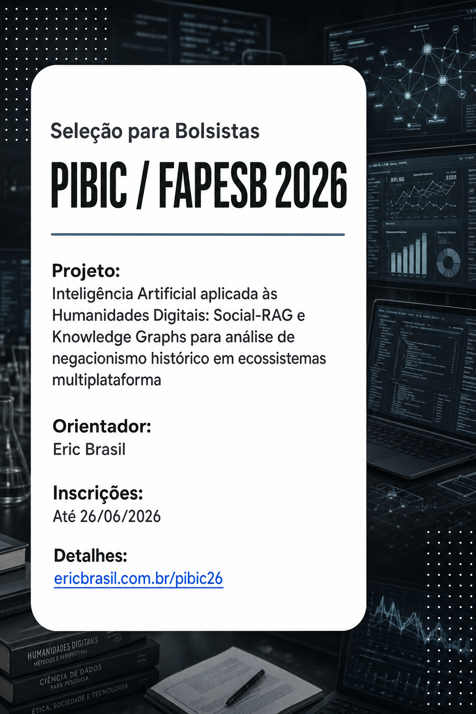

## 1. Informações Gerais

A Coordenação do projeto de pesquisa **PVM2451-2026** — *"Inteligência Artificial aplicada às Humanidades Digitais: Social-RAG e Knowledge Graphs para análise de negacionismo histórico em ecossistemas multiplataforma"* convida estudantes de graduação do Instituto de Humanidades e Letras da UNILAB a se candidatarem a **2 (duas) vagas de bolsista de Iniciação Científica** no âmbito do Edital PROPPG nº 08/2026 — PIBIC/FAPESB.

O projeto foi aprovado com 2 cotas de bolsa FAPESB, cada uma vinculada a um plano de trabalho distinto. A seleção é unificada: a candidatura é feita para o projeto, e a atribuição dos planos ocorrerá conforme o perfil e a adequação de cada pessoa selecionada.

**Título do Projeto:** *Inteligência Artificial aplicada às Humanidades Digitais: Social-RAG e Knowledge Graphs para análise de negacionismo histórico em ecossistemas multiplataforma*

**Planos de Trabalho:**

1. **Curadoria de corpus e análise de negacionismo histórico no ecossistema Telegram-YouTube com Social-RAG**
2. **Modelagem relacional e construção de Knowledge Graphs para análise de narrativas de negacionismo histórico em plataformas digitais**

- **Modalidade:** PIBIC/FAPESB
- **Vigência:** 01/10/2026 a 30/09/2027
- **Valor da bolsa:** R$ 700,00/mês
- **Carga horária:** 20h semanais
- **Orientador:** Prof. Eric Brasil Nepomuceno (IHL/UNILAB)
- **Laboratórios envolvidos:** IHL/UNILAB (Malês) e LABHDUFBA (UFBA)
- **Financiamento:** Projeto vinculado ao edital CNPq/Decit/SECTICS/MS nº 30/2024 — Eixo I: Gestão da Infodemia (Processo 442958/2024-2)

- [Clique aqui](./projeto_pesquisa.html) para acessar o projeto de pesquisa completo.
- [Clique aqui](./plano01.html) para acessar o plano de trabalho 1 (Social-RAG).
- [Clique aqui](./plano02.html) para acessar o plano de trabalho 2 (Knowledge Graphs).

---

## 2. Requisitos para a candidatura

1. Estar regularmente matriculado(a) em curso de graduação do Instituto de Humanidades e Letras da UNILAB, **no campus da Bahia** (requisito da modalidade PIBIC/FAPESB).
2. Ter coeficiente de rendimento acadêmico (CRA) **≥ 7,0**.
3. Não ter vínculo empregatício nem outra bolsa acadêmica (exceto auxílios estudantis como PNAES).
4. Dedicar **20 horas semanais** às atividades da pesquisa.
5. Disponibilidade para **reuniões presenciais quinzenais em Salvador (LABHDUFBA/UFBA)** — obrigatório.
6. Desenvolver o **Trabalho de Conclusão de Curso (TCC)** vinculado à pesquisa, sob orientação do Prof. Eric Brasil.
7. Compromisso com a realização de **trabalho em equipe**, com supervisão direta do orientador e interação com mestrandos e doutorandos vinculados ao projeto.
8. Currículo Lattes cadastrado e atualizado no ano de 2026.
9. Disponibilidade para cadastro como Pesquisador FAPESB (siga.fapesb.ba.gov.br) e no SEI Bahia, em caso de seleção.

---

## 3. Perfil esperado

Buscamos estudantes **proativos, abertos a aprender e dispostos a trabalhar em equipe**. A pesquisa é interdisciplinar e envolve tanto análise crítica de fontes historiográficas quanto ferramentas computacionais. A supervisão contar com mestrandos e doutorandos vinculados ao projeto, o que exige colaboração e capacidade de aprender com pares mais experientes.

- Interesse em ferramentas e métodos digitais aplicados às humanidades e ciências sociais.
- **Proatividade** na busca por soluções e no autodidatismo guiado.
- **Abertura para aprender** métodos e ferramentas novas, mesmo fora da área de formação.
- Capacidade de **trabalho em equipe multidisciplinar**, com supervisão de mestrandos e doutorandos.
- Compromisso com prazos e demandas regulares.
- Responsabilidade no tratamento de **dados públicos digitais**, seguindo protocolos éticos e LGPD.
- Respeito, empatia e tolerância.

**Preferencialmente:**

- Conhecimento básico de Python ou outra linguagem de programação.
- Inglês instrumental para leitura de literatura.
- Estar cursando História, Ciências Sociais ou Computação.

---

## 4. Processo de Seleção

**Etapa 1 (eliminatória):** Análise de documentos — carta de interesse, histórico escolar, currículo Lattes atualizado e comprovante de CRA. Verificação dos requisitos obrigatórios (matrícula na Bahia, CRA ≥ 7,0, disponibilidade para reuniões presenciais e TCC vinculado).

**Etapa 2 (classificatória):** Entrevista online (Google Meet) com o orientador e membros da equipe de pesquisa. A entrevista avaliará:

- Motivação e disponibilidade real para a carga horária exigida.
- Perfil colaborativo e abertura para aprender.
- Adequação ao perfil de cada plano de trabalho.
- Capacidade de trabalhar sob supervisão de mestrandos e doutorandos.

A atribuição dos planos de trabalho (1 — Social-RAG ou 2 — Knowledge Graphs) será definida pelo orientador com base no perfil da pessoa selecionada e nas necessidades do projeto.

---

## 5. Cronograma

- **Abertura da chamada**: **19/06/2026**
- **Inscrições**: até **26/06/2026, 23h59**
    - Enviar os seguintes documentos para [profericbrasil@unilab.edu.br](mailto:profericbrasil@unilab.edu.br):
      - Carta de interesse (.md, .txt, .odt ou .pdf) — explicando motivação, disponibilidade e preferência de plano (se houver)
      - Histórico escolar (PDF)
      - Comprovante de CRA (PDF)
      - Currículo Lattes atualizado (PDF)
- **Resultado da 1ª fase (eliminatória)**: **29/06/2026, até 18h**
- **Entrevistas**: **Data a ser divulgada após a 1ª fase** (via Google Meet; horário a confirmar conforme número de classificados)
- **Resultado final**: **A ser divulgado após as entrevistas**
- **Entrega da documentação completa para implementação da bolsa (conforme edital institucional)**: **29/06 a 14/07/2026**

> ⚠️ **Atenção:** O cronograma é comprimido em razão do prazo de indicação documental FAPESB estabelecido pelo edital PROPPG 08/2026 (item 10.2). A não entrega da documentação completa no prazo implica perda da cota de bolsa.

---

## 6. Detalhes dos Planos de Trabalho

### Plano 1 — Curadoria de corpus e análise de negacionismo histórico no ecossistema Telegram-YouTube com Social-RAG

O plano tem como objetivo realizar a curadoria de subconjuntos temáticos do corpus Telegram-YouTube e aplicar a arquitetura Social-RAG para identificar e analisar padrões discursivos, enquadramentos narrativos e estratégias argumentativas do negacionismo histórico em ecossistemas digitais multiplataforma.

**Atividades principais:**

- Identificação e mapeamento de canais e grupos do Telegram que mobilizam narrativas de negacionismo histórico, bem como os vídeos do YouTube vinculados.
- Seleção, organização e padronização de subconjuntos temáticos do corpus segundo o protocolo do Social-RAG.
- Formulação e execução de consultas hermenêuticas e factuais no Social-RAG.
- Análise qualitativa dos resultados, com construção de categorias analíticas fundamentadas nos dados.
- Redação de artigo acadêmico como primeiro autor(a).
- Apresentação de resultados no Encontro de Iniciação Científica da UNILAB.

**Capacitação prevista:** Python, Git/GitHub e operação do Social-RAG (3 primeiros meses).

### Plano 2 — Modelagem relacional e construção de Knowledge Graphs para análise de narrativas de negacionismo histórico em plataformas digitais

O plano tem como objetivo desenvolver e aplicar módulos de Knowledge Graphs integrados ao pipeline Social-RAG para modelar relações entre entidades (atores, eventos históricos, organizações, fontes, vídeos) e visualizar as redes de referência mobilizadas nas narrativas de negacionismo histórico.

**Atividades principais:**

- Identificação e definição das entidades de interesse e das relações relevantes no corpus sobre negacionismo histórico.
- Elaboração de esquemas de representação relacional, com tipologias de nós e arestas.
- Extração de entidades e relações a partir de mensagens do Telegram e transcrições de vídeos do YouTube, utilizando ferramentas de NLP e o Social-RAG como apoio.
- Construção de Knowledge Graphs exploratórios e produção de visualizações interativas.
- Avaliação crítica da utilidade e dos limites dos Knowledge Graphs para a análise histórica.
- Redação de artigo acadêmico como primeiro autor(a).
- Apresentação de resultados no Encontro de Iniciação Científica da UNILAB.

**Capacitação prevista:** Python, Git/GitHub, NetworkX, Neo4j e ferramentas de NLP (3 primeiros meses).

---

## 7. Informações sobre a modalidade PIBIC/FAPESB

A bolsa PIBIC/FAPESB é fomentada pela Fundação de Amparo à Pesquisa do Estado da Bahia (FAPESB) e destina-se a estudantes de graduação cursando no estado da Bahia. Os requisitos específicos da modalidade incluem:

- Estar regularmente matriculado(a) e cursando graduação **no estado da Bahia**.
- Cadastro como Pesquisador FAPESB (siga.fapesb.ba.gov.br).
- Cadastro no SEI Bahia.
- Conta corrente no Banco do Brasil (para depósito da bolsa).
- Currículo Lattes atualizado no ano da implementação da bolsa.
- Não acumular outra bolsa de mesmo nível financiada com recursos públicos durante a vigência.
- Entregar relatório parcial (01/04/2027) e relatório final (01/10/2027) via SIGAA.
- Apresentar os resultados da pesquisa no Evento de Iniciação Científica da UNILAB.

Para dúvidas: [profericbrasil@unilab.edu.br](mailto:profericbrasil@unilab.edu.br)

